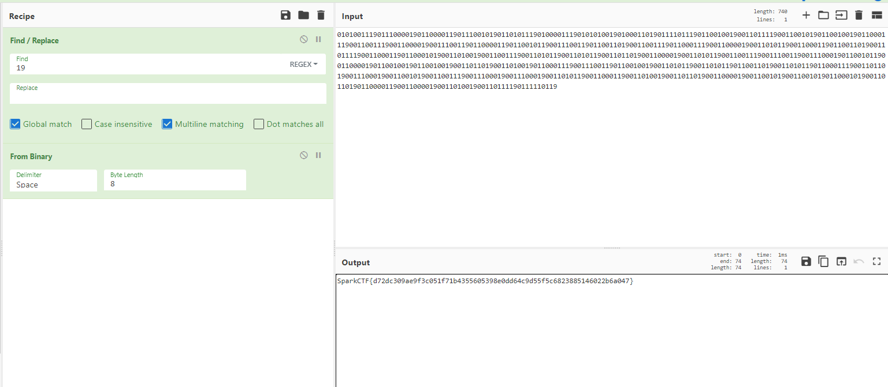

In the PCAP file we notice a pattern of ICMP packets without a response, 
after those packets we start getting a pattern of ones and zeros in the Type field with the destination ip 172.51.49.69

If we follow them and extract bit by bit and we decode it , we get the flag


```bash 

$ tshark  -r ghost.pcapng -Tfields -e "icmp.type" -Y "ip.addr == 172.51.49.69" | tr -d '\n'> out.txt

$ cat out.txt 

01010011190111000019011000011901110010190110101119010000111901010100190100011019011110111901100100190011011119
00110010190110010019011000111900110011190011000019001110011901100001190110010119001110011901100110190011001119
01100011190011000019001101011900110001190110011019001101111900110001190110001019001101001900110011190011010119
00110101190011011019001100001900110101190011001119001110011900111000190110010119001100001901100100190110010019
00110110190011010019011000111900111001190110010019001101011900110101190110011019001101011901100011190011011019
00111000190011001019001100111900111000190011100019001101011900110001190011010019001101101900110000190011001019
00110010190110001019001101101901100001190011000019001101001900110111190111110119


```

We notice there's some invalid bits '19' which is just a space so replacing that with a space and decoding we get the flag



